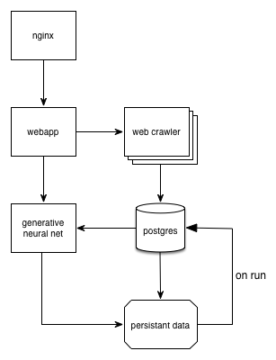

# Neural Niche Docker Config

### Using:
- combination of ubuntu 15.04 (not sure why but think there was a reason at one point) containers with python3.4
- wanted to use python3.5 for parts but dependencies didn't support it (postgres needs psycopg2)

## Docker Container Setup
### GPU centered stuff
Using the official Nvidia Dockerfile:
https://github.com/nvidia/nvidia-docker
Official Documentation:
http://developer.download.nvidia.com/compute/cuda/7.5/Prod/docs/sidebar/CUDA_Quick_Start_Guide.pdf
Cuda Downloads:
https://developer.nvidia.com/cuda-downloads

Notes:
- I built my own docker image based off this after trying to use the one supported by theano: https://hub.docker.com/r/kaixhin/cuda-theano/~/dockerfile/ due to that one not working for me (not being able to get CUDA support).  Important that you have CUDA stuff installed on bare bones server as well as in the docker image (I think)
- I use the file nvidia-docker https://raw.githubusercontent.com/NVIDIA/nvidia-docker/master/nvidia-docker provided by Nvidia to use GPU in container but symlink to /usr/local/bin/ in provisioning
- https://hub.docker.com/r/nvidia/cuda/

to build:
sudo docker build -t nnkeras nndocker/

the way to run it is then (well if you want to interactive into):
sudo GPU=0,1 nvidia run -it nnkeras

While I am using different python versions amongst stuff, I should ideally consolidate to one version

## Scraping YouTube
https://developers.google.com/youtube/v3/code_samples/python#search_by_keyword
https://developers.google.com/youtube/v3/docs/search/list

## PostgresSQL DB

main table:
videoid     string
title       string
subs/cc     bool

subs table:
videoid     string
ifsubs      string

# Coordinating App with Docker Compose

Because the app requires multiple parts

## Docker-Compose Links:
https://docs.docker.com/engine/userguide/networking/default_network/dockerlinks/
https://docs.docker.com/compose/compose-file/#links
https://docs.docker.com/compose/extends/

# Helpful Docker stuff

## Stop and Remove all docker containers
sudo docker stop $(sudo docker ps -a -q)
sudo docker rm $(sudo docker ps -a -q)

